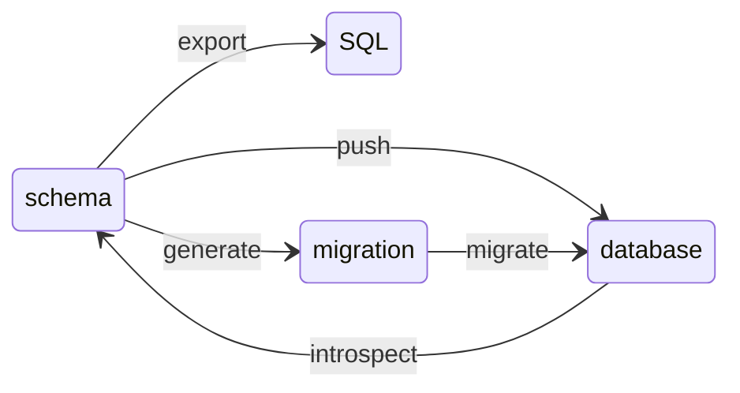

### Step 1 - Setup basic file structure

```
<project root>
  |- drizzle.config.ts
  |- src/
    |- db/
      |- db.ts
      |- schema.ts
  |- migrations/
      |- 0000_xyz.sql
```

### Step 2 - Install required packages

install drizzle dependencies

```bash
#pnpm
pnpm add drizzle-orm
pnpm add -D drizzle-kit

# bun
bun add drizzle-orm
bun add -D drizzle-kit
```

we also need to install the database driver:

#### Sqlite with Bun builtin driver

```bash
# you don't need to add anything as Bun has built-in sqlite driver.
```

#### Sqlite with libsql driver

```bash
npm add @libsql/client
```

#### Postgres

Install node-postgres package

```bash
pnpm add pg
```

### Step3 - Setup Drizzle config file

Drizzle config file is used by Drizzle Kit which contains all the information about your database connection, migration folder and schema files.

```bash
# drizzle.config.ts
import 'dotenv/config';
import { defineConfig } from 'drizzle-kit';
export default defineConfig({
  out: './drizzle',
  schema: './src/db/schema.ts',
  dialect: 'sqlite',  # 'postgresql' for postgres
  dbCredentials: {
    url: process.env.DB_FILE_NAME!,
  },
});
```

### Step4 - Connect Drizzle ORM to the database

#### Sqlite with Bun builtin driver

```bash
# src/db/db.ts

import { drizzle } from 'drizzle-orm/bun-sqlite';

const db = drizzle(process.env.DB_FILE_NAME!);
# or
const db = drizzle({ connection: { source: process.env.DB_FILE_NAME! }});
```


#### Sqlite with libsql driver

```bash
# src/db/db.ts

import { drizzle } from 'drizzle-orm/libsql';

const db = drizzle(process.env.DB_FILE_NAME!);
# or
const db = drizzle({ connection: { url: process.env.DB_FILE_NAME! }});
```

#### Postgres with node-postgres driver

```bash
# src/db/db.ts

import { drizzle } from 'drizzle-orm/node-postgres';


const db = drizzle(process.env.DATABASE_URL!);
# or
const db = drizzle({ 
  connection: { 
    connectionString: process.env.DATABASE_URL!,
    ssl: true
  }
});
# or
import { Pool } from "pg"; 
const pool = new Pool({
  connectionString: process.env.DATABASE_URL!,
});
const db = drizzle({ client: pool });
```

### Step5 - Add schemas

```bash
# src/db/schema.ts

import { int, sqliteTable, text } from "drizzle-orm/sqlite-core";

export const usersTable = sqliteTable("users", {
  id: int().primaryKey({ autoIncrement: true }),
  name: text().notNull(),
  age: int().notNull(),
  email: text().notNull().unique(),
});
```

## Typical Production Flow

1. Update schema.ts
2. drizzle-kit generate
3. Review SQL
4. drizzle-kit migrate
5. Deploy

## Drizzle Kit




### Sync Drizzle schema to database

```bash
npx drizzle-kit push
```

**What it does**

1. read `schema.ts`
2. compare to live database
3. execute necessary `ALTER`/`CREATE` statements
4. Does NOT create migration history


### Generate Drizzle schema from database

```bash
npx drizzle-kit introspect
```

**What it does**

1. connect to DB
2. read table definition
3. convert DB struct to drizzle schema format
4. output TypeScript schema file


### Generate SQL from schema definition

```bash
npx drizzle-kit export
```

**What it does**
1. reads `schema.ts`
2. generate full SQL schema snapshot
3. output raw SQL

### Generate migration files

```bash
npx drizzle-kit generate
```

**What it does**

1. read your `schema.ts`
2. compare it to the last recorded snapshot
3. calc the SQL diff
4. generated a timestamped migration file
5. updates the snapshot metadata

### Apply migrations

```bash
npx drizzle-kit migration
```

**What it does**

1. connect to DB
2. create `_drizzle_migrations` table if needed
3. checks applied migrations
4. run unapplied SQL files
5. record execution

### Launch Drizzle studio

```bash
npx drizzle-kit studio
```

### Validate whether schema and database are in sync

```bash
npx drizzle-kit check
```

**What it does**
- compare your schema file (`schema.ts`)
- compare applied migrations
- detect drift between DB and schema
- fail with exit code if differences exist
